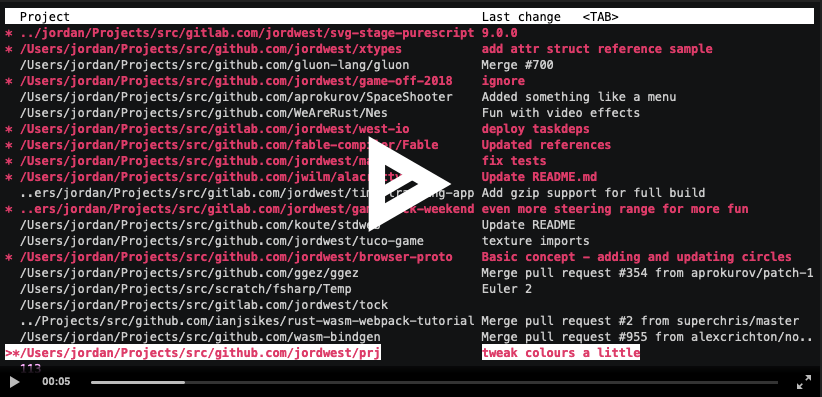

# prj

`prj` is a command line tool that helps you jump between your local `git` repositories.

## Features

- Fast fuzzy find your project thanks to [fuzzy-matcher](https://github.com/lotabout/fuzzy-matcher)
- Displays git information from each project:
  - Last commit summary
  - Currently checked out branch
  - Pending/uncommitted changes

## Demo

[](https://asciinema.org/a/296118)

## Installation

### MacOS (With Homebrew)

```sh
brew tap jordwest/homebrew-tools
brew install prj
```

### All platforms

Note **openssl** must be installed.

This hasn't yet been tested on other platforms, but binaries are available for Windows, Linux and MacOS.

Check the [Releases](https://github.com/jordwest/prj/releases) tab for the latest build.

### Compiling from source

First install [Rust](https://www.rust-lang.org/tools/install), then run:

```
cargo install prj
```

## Setup

Set the root to search projects with:

```sh
prj configure
```

This will create a `.prj` file in your home directory containing the configuration in TOML format.

## Usage

### `prj list`

Running `prj list` will show an interactive fuzzy search.

Start typing to search the list. Projects marked with `*` and highlighted in red are projects with uncommitted changes.

`<TAB>` cycles through the repository information displayed in the second column.

`<ESC>` cancels and exits.

When a project is selected, the path to the project will be sent to `stdout`. You can cd into the selected directory with `cd $(prj list)`, however the recommended way to jump to projects is to add a function to your `.bashrc` or `.profile`:

```sh
function p() {
	local dir
	dir=$(prj list) && cd $dir
}
```

Once you've added this function, reopen your terminal and run `p` from anywhere.

# Roadmap

## [v1.0 milestone](https://github.com/jordwest/prj/milestone/1)
